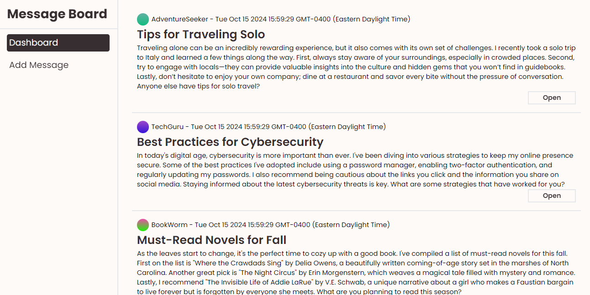
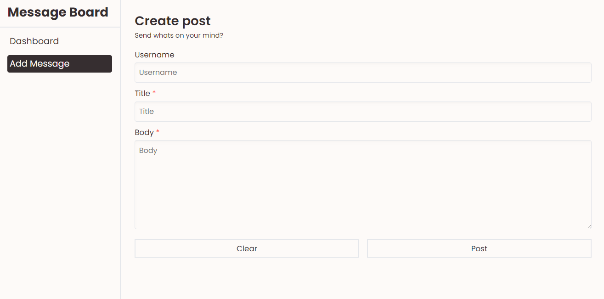
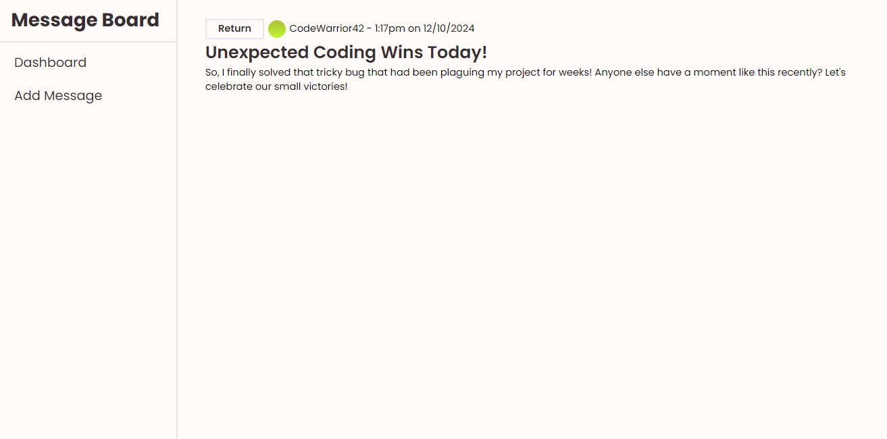

# Simple_Message_Board
A simple message board application built with Node.js, Express, EJS using Postgres for database.

## Table of Contents
- [Installation](#installation)
- [Features](#features)
- [Tech Stack](#tech-stack)
- [Project Structure](#project-structure)
- [Screenshots](#Screenshots)
- [License](#license)


## Installation
1. **Clone the repository:**
    ```bash
    git clone https://github.com/Ama4538/Simple_Message_Board.git
    cd Simple_Message_Board
    ```
2. **Install dependencies:**
    ```bash
    npm i
    ```
3. **Start the server:**
    ```bash
    npm start
    ```
4. **Access the application:**
Open your browser and go to http://localhost:8080.

## Features
- Able to add new messages
- View each messages in a separate page

## Tech Stack
- Node
- Express
- CSS
- EJS

## Project Structure
```
├── controllers/                # All Controllers    
│   ├── messageControllers.js   # Controllers for all messages related content
├── database/                   # All database related files
│   ├── pool.js                 # Set up pool connect
|   ├── queries.js              # All Database queires
├── public/                     # Static Files
│   ├── style.css               # Styling
├── routes/                     # All routes
│   ├── indexRoute.js           # Main dashboard
│   ├── messageRoute.js         # Individual Messages
│   ├── newMessageRoute.js      # Adding Messages
├── views/                      # EJS Template
│   ├── form.js                 # Form component
│   ├── index.js                # Main view
│   ├── message.js              # View messages component
├── app.js                      # Main application file
├── .gitignore                  # Git ignore file
└── package.json                # Project metadata and dependencies
```
## Screenshots



## License
Distributed under the MIT License. See `LICENSE` for more information.